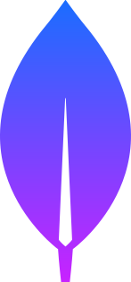
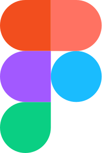

   

<h1 align="center">Hi , I'm Sohag</h1> 
<h3 align="center">A passionate front-end web developer from 🇧🇩</h3>  
    
I am Md. Sohag, a dedicated and enthusiastic React front-end developer with knowledge of full-stack development. With a keen eye for detail and six months of dedicated learning, I've immersed myself in the world of web development, specializing in React.js for front-end development. I also possess knowledge of Express.js for server-side development and MongoDB for working with databases. This allows me to tackle end-to-end development tasks and build robust, scalable web applications.   
 
 

## :chart_with_upwards_trend: Current Status
 

  

<!-- Stars,Followers,PullRequest -->
 

  

 

 

## :mailbox: Reach me out
 

 

## :computer: Technologies that I know

 

 

## :computer: Technologies that currently learning

 

 

 

## :computer: Technologies I want to learn next
 

 

## :eyes: Current overview

Here are some ideas to get you started:

### 🌱 I’m currently learning - node.js, express.js, mongo db
### 👯 I’m looking to collaborate on - To collaborate on open source projects.
### 🔭 I’m currently exploring - Advance React js
### 🤔 I’m looking for help with ...

