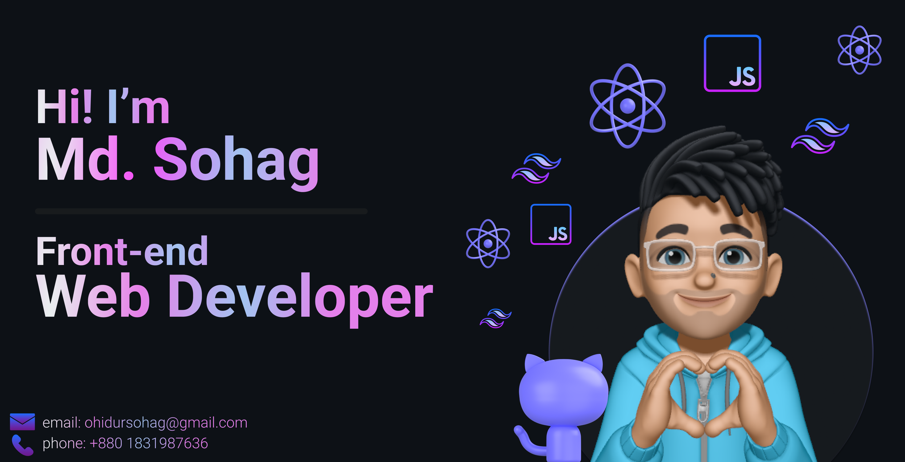

   

<h1 align="center">Hi , I'm Sohag</h1> 
<h3 align="center">A passionate front-end web developer from 🇧🇩</h3>  

  

<!-- Stars,Followers,PullRequest -->

  

**ohidursohag/ohidursohag** is a ✨ _special_ ✨ repository because its `README.md` (this file) appears on your GitHub profile.

Here are some ideas to get you started:

- 🔭 I’m currently working on ...
- 🌱 I’m currently learning ...
- 👯 I’m looking to collaborate on ...
- 🤔 I’m looking for help with ...
- 💬 Ask me about ...
- 📫 How to reach me: ...
- 😄 Pronouns: ...
- ⚡ Fun fact: ...

